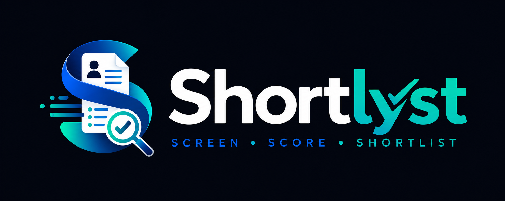
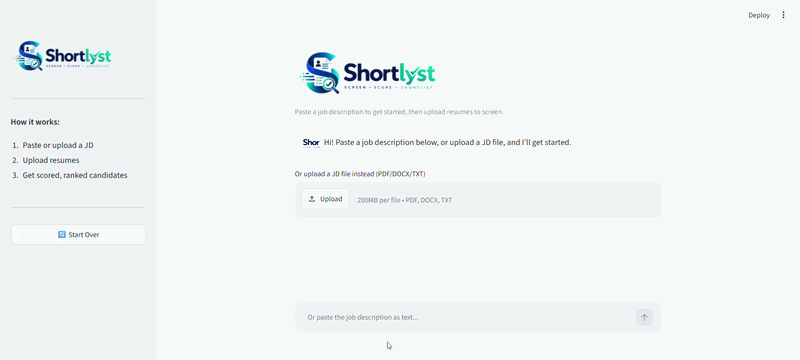
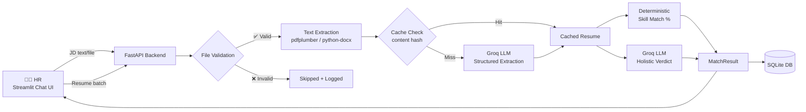

<p align="center">
  
</p>

<h3 align="center">Screen. Score. Shortlist.</h3>

<p align="center">
  An AI-powered resume screening tool that turns a pile of resumes into a ranked, explainable shortlist — in minutes, not hours.
</p>

<p align="center">
  
  
  
  
  
  
</p>

<p align="center">
  <a href="https://shortlyst-resumes.streamlit.app/"><strong>🚀 Try it live →</strong></a>
</p>
---

## 📑 Table of Contents

- [What is Shortlyst?](#-what-is-shortlyst)
- [Demo](#-demo)
- [Features](#-features)
- [Architecture](#-architecture)
- [Anti-Hallucination Design](#-anti-hallucination-design)
- [Tech Stack](#-tech-stack)
- [Getting Started](#-getting-started)
- [Project Structure](#-project-structure)
- [Roadmap](#-roadmap)
- [License](#-license)

---

## 🎯 What is Shortlyst?

Recruiters manually screening dozens of resumes against a job description is slow and inconsistent. **Shortlyst automates the first pass** — upload a JD and a batch of resumes, get back a ranked, evidence-backed fit report per candidate.

> Shortlyst is a **decision-support tool, not a decision-maker.** Every score comes with the evidence behind it — matched skills, missing skills, and a short verdict — so the human always makes the final call.

---
## 🌐 Live Demo

**[shortlyst-resumes.streamlit.app](https://shortlyst-resumes.streamlit.app/)**

> ⏳ Note: the backend runs on Render's free tier, which sleeps after 15 minutes of inactivity. The first request after a period of inactivity may take 30–50 seconds to wake up — subsequent requests are fast.

## 🎬 Demo

<!--
  📚 How to add your own demo GIF/video here:
  1. Record your screen using a tool like ScreenToGif (Windows), Kap (Mac), or OBS
  2. Save it as demo.gif in an /assets folder
  3. Replace the line below with:
     <p align="center"></p>

  Or for a YouTube video, use this pattern instead:
     [](https://youtu.be/YOUR_VIDEO_ID)
-->

<p align="center">
  
</p>

<p align="center"><i>🎥 Demo GIF of the Prototpye</i></p>

---

## ✨ Features

- [x] 💬 **Chat-style interface** — paste a JD as plain text or upload a file, no rigid forms
- [x] 📄 **Multi-format support** — reads PDF, DOCX (and TXT for JDs)
- [x] 🧠 **Structured LLM extraction** — Groq's strict JSON-schema mode, zero-hallucination by design
- [x] 🎯 **Two-part scoring** — deterministic skill-match % (code) + LLM holistic verdict (grounded, never re-reads raw resume text)
- [x] ⚡ **Bounded concurrency** — async batch processing with a semaphore, no rate-limit blowouts
- [x] 💾 **Smart caching** — same resume never gets re-parsed or re-billed
- [x] 🔒 **File validation** — magic-byte checks, size caps, no trust in file extensions alone
- [x] 🗄️ **Persistent storage** — SQLite-backed, survives restarts
- [x] 📊 **Visual results** — color-coded fit scores, progress bars, CSV export
- [ ] 🔐 Auth / multi-tenancy
- [ ] 🚦 API-level rate limiting

---

## 🏗️ Architecture



**Flow:** HR uploads JD → extracted into a structured schema → HR uploads resumes → each one validated, read, cache-checked, extracted (concurrently, rate-bounded) → scored via a deterministic skill match *and* a grounded LLM verdict → results ranked and shown back in the chat, with everything persisted to disk.

---

## 🛡️ Anti-Hallucination Design

The riskiest part of a tool like this is an LLM inventing qualifications a candidate doesn't have. Shortlyst is built around minimizing that risk at every layer:

| Layer | Mitigation |
|---|---|
| **Schema** | Every field except JD role is `Optional` — the model is never pressured to fabricate a value to satisfy a required field |
| **Extraction** | Groq's strict `json_schema` mode + `temperature=0` — same input always produces the same structured output |
| **Prompting** | Explicit rules: *"null over guessing," "don't infer typical values," "don't paraphrase into stricter/looser language"* |
| **Scoring** | Skill-match % is computed in plain Python (set overlap + fuzzy matching) — never LLM-guessed |
| **Verdict** | The verdict-generation call only ever sees already-extracted structured JSON — never the raw resume text again |
| **Transparency** | Every result includes an `extraction_confidence` field, flagging sparse or poorly-parsed resumes instead of silently scoring them |

---

## 🧰 Tech Stack

<p align="left">
  
  
  
  
  
  
  
</p>

| Category | Tools |
|---|---|
| Backend | FastAPI, SQLModel, SQLite |
| Frontend | Streamlit |
| LLM | Groq API (structured output mode) |
| Parsing | pdfplumber, python-docx |
| Validation | Pydantic v2 |
| Package management | uv |

---

## 🚀 Getting Started

```bash
# clone
git clone https://github.com/anjali-singh-cyber/shortlyst.git
cd shortlyst

# install deps
uv sync

# add your Groq API key
cp .env.example .env
# then paste your key into .env
```

Run the backend and frontend in **two separate terminals**:

```bash
# terminal 1 — API server
uv run uvicorn api.main:app --reload
```

```bash
# terminal 2 — dashboard
uv run streamlit run app.py
```

Then open <kbd>http://localhost:8501</kbd> in your browser.

---

## 📁 Project Structure

```
shortlyst/
├── schemas/     → Pydantic models (Job, Resume, MatchResult)
├── core/        → Extraction, scoring, caching, file handling logic
├── llm/         → Groq client wrapper (sync + async)
├── prompts/     → System prompts, isolated for easy iteration
├── api/         → FastAPI routes, DB models, in-request store
├── assets/      → Logo, demo media
└── app.py       → Streamlit chat dashboard
```

---

## 🗺️ Roadmap

- [x] Core extraction + scoring pipeline
- [x] Caching, concurrency, file security
- [x] FastAPI backend + Streamlit chat UI
- [x] Persistent storage (SQLite)
- [ ] Auth & multi-tenant job scoping
- [ ] API-level rate limiting (`slowapi`)
- [ ] Data retention policy + encryption at rest
- [ ] Embedding-based skill matching (beyond fuzzy string match)

---

## 📄 License

Apache-2.0 — free to use, modify, and build on.

<p align="center">
  Built with ☕ and a lot of debugging by <a href="https://github.com/anjali-singh-cyber">Anjali Singh</a>
</p>